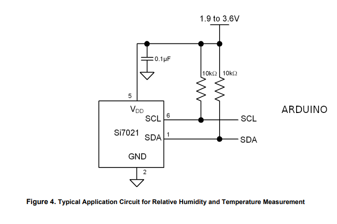
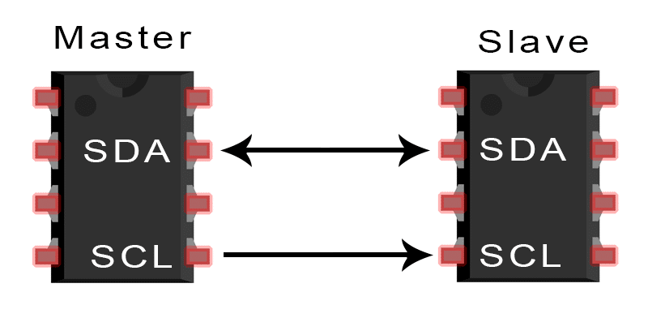
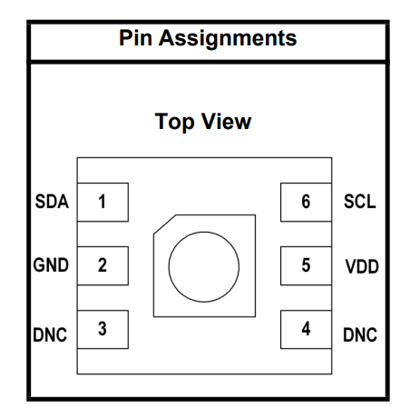

# SI7021 Temperature Sensor I2C Arduino Tester

## Overview
This project provides an **Arduino sketch** to interface with the **SI7021 temperature and humidity sensor** via **I2C communication**. It displays temperature readings on the **Serial Monitor** and provides **LED indications** based on temperature conditions.

---

## Features
- **Reads temperature data** from the SI7021 sensor using I2C.
- **Displays readings** on the Serial Monitor.
- **Green LED (Pin 4):** Lights up if the temperature is above **10°C**.
- **Red LED (Pin 3):** Blinks if the sensor fails or communication is lost.

---

## Prerequisites
### Hardware Requirements
- **Arduino Board** (Uno, Mega, Nano, etc.)
- **SI7021 Temperature & Humidity Sensor**
- **Jumper Wires**
- **LEDs & Resistors** (for visual indication, optional)

### Software Requirements
- **Arduino IDE** (Latest version recommended)
- **SI7021 Library (optional)**: Uses built-in I2C communication, but additional libraries can be installed for extended features.

---

## Wiring Diagram
| SI7021 Pin | Arduino Pin |
|-----------|-------------|
| **VCC**   | 3.3V / 5V   |
| **GND**   | GND         |
| **SCL**   | A5 (Uno) / Pin 21 (Mega) |
| **SDA**   | A4 (Uno) / Pin 20 (Mega) |

For reference, see the **circuit diagram:**


Additionally, here is the **I2C communication diagram**:


And the **SI7021 sensor pinout** for better understanding:


---

## Setup & Installation
### 1. Connect the SI7021 Sensor
- Wire the sensor to the Arduino using the table above.
- Ensure **SDA** and **SCL** lines are correctly connected.

### 2. Upload the Code
- Open the Arduino IDE.
- Load `arduino_code_Si7021.ino`.
- Select your board and COM port.
- Click **Upload**.

### 3. Open the Serial Monitor
- Set baud rate to **115200**.
- You should see real-time temperature readings.

---

## Expected Serial Output
When the sensor is working correctly:
```
I2C communication started
Temperature: 22.5 C
Temperature: 22.6 C
Temperature: 22.7 C
```
If there is an error in communication:
```
I2C communication failed
Temperature: -999.0 C
```
(Refer to `serial_test_ok.png` and `serial_test_error.png` for expected results.)

---

## Troubleshooting
### 1. No Temperature Readings
- Check wiring connections.
- Ensure correct I2C address (`0x40`).
- Try another **Arduino board** or **sensor**.

### 2. Sensor Not Responding
- Use an **I2C scanner sketch** to detect connected devices.
- Check if pull-up resistors are required on **SDA** and **SCL**.

### 3. Incorrect Readings
- Verify power supply (3.3V or 5V as per sensor specs).
- Avoid long jumper wires to prevent I2C noise.

---

## Additional Resources
- **SI7021 Datasheet**: [Manufacturer Website](https://www.silabs.com/documents/public/data-sheets/Si7021-A20.pdf)
- **Arduino I2C Documentation**: [Arduino.cc](https://www.arduino.cc/en/reference/wire)

---
